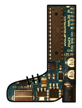

## Optiboot Bootloader for Arduino and Atmel AVR ##

Optiboot is an easy to install upgrade to the Arduino bootloader within Arduino boards. It provides the following features:

  * Allows larger sketches. Optiboot is only 512 bytes, freeing 1.5k of extra code space compared to older bootloaders.
  * Makes your sketches upload faster. Optiboot operates at higher baud rates and has streamlined programming.
  * Adaboot performance improvements. Optiboot implements "fastboot" that starts sketches immediate after power-on.
  * Compatible with ATmega8, ATmega168, and ATmega328p Arduinos and derivatives including Lilypad, Pro, Nano, and many derivatives.
  * Works with *MANY* additional Atmel AVR chips - almost anything that supoorts bootloads or "flash self-programming."  This includes chips from ATtiny 8pin chips through the 100pin ATmega2560 used on Arduino Mega.
  * Supports alternate serial ports, cpu frequencies and baud rates.

Optiboot (an older version) is installed by default on the Arduino Uno and (as of 2018) official Arduino Nano boars.  It can be installed on all older mega8, 168 or 328 based Arduinos.

## Optiboot_X
As of 2019, Atmel was acquired by Microchip Inc, and released several "new" architectures with the AVR CPU.  These are known as the Mega-0, Tiny-0, and Tiny-1 Series.  While the basic CPU operation is about the same as older AVRs, the peripherals, including Flash self-programming, are significantly different.  This justified a new version of Optiboot with separate source code and Makefiles, which we're calling "optiboot_x" (the new AVR chips closely resemble the "AVR XMega" chips.)

## Additional Documentation
More detailed documentation is being added (slowly) to the [repository wiki](https://github.com/Optiboot/optiboot/wiki).

## Notes on IDE Version compatability
Optiboot is "compatible", in a loose sense, with all versions of the Arduino IDE.  It was originally written at about the same time as v1.0, and has some "quirks" that date back to that timeframe.  Most significantly, the directory structure of the git repository is "weird."

## To install into the Arduino software ##
You do NOT need to "install" Optiboot if you are trying to update an installed platform that already uses some form of Optiboot.  In fact, you should almost certainly NOT install Optiboot using the board manager.
The Optiboot github repository these days is mostly useful as a sorce-code repository, for anyone who needs to make a highly customized version for some reason.  Or an improvement to Optiboot itself.

Most end users should find a supported "Arduino Core" that includes Optiboot for their desired target, and install that.  Many such cores are provided by the hardware vendor, and they'll include Board defintions, Variant files, and Arduino core code neeed to support the target as well as one or more Optiboot .hex files that should work.

There are also some major repositories of "generic" versions of cores for various targets, including:

  * [MegaCore by MCUdude](https://github.com/MCUdude/MegaCore) Supports large AVRs like ATmega128, ATmega640, ATmega1280, ATmega1281, ATmega2560 and ATmega2561.
  * [MightyCore by MCUdude](https://github.com/MCUdude/MightyCore) Supports most 40pin AVRs including ATmega1284, ATmega644, ATmega324, ATmega32, and ATmega8535.
  * [MiniCore by MCUdude](https://github.com/MCUdude/MiniCore) Supports most 28pin ATmega AVRs, including the cpus used by Uno/etc as well as the new cpus like the ATmega328PB.
  * [MajorCore by MCUdude](https://github.com/MCUdude/MajorCore) Supports a couple of relatively obsolete large AVRs, like ATmega8515 and ATmega162.
  * [ATTinyCore by Spence Konde](https://github.com/SpenceKonde/ATTinyCore) Supports many ATtiny AVRs, including ATtiny85, ATtiny1634, ATtiny84, and ATtiny841.
  * [MegaCoreX by MCUdude](https://github.com/MCUdude/MegaCoreX) Supports the Mega-0 Series AVRs (notably the ATmega480x and ATmega320x) (Using Optiboot_X.)
  * [megaTinyCore by Spence Konde](https://github.com/SpenceKonde/megaTinyCore) Supports many of the Tiny-0 and Tiny-1 series AVR chips (using Optiboot_X.)

If you need a new Optiboot feature not included in a pre-packaged core, the recommended procedure is to download or fork the source code, manually compile the version you need, and copy the .hex file to the existing board directory (after renaming the old .hex file, in case you need it back.)

Nevertheless, there is an automatically installable Board Manager package that includes the .hex files for Optiboot on several popular Arduino boards (a very small subset of the possible targets.). Using the Optiboot "install" procedure does not install any cores or variants, so it is only useful for CPUs that are already supported by the standard Arduino core.

The following instructions are based on using the Arduino "Board Manager", present in IDE versions 1.6.5 and later.

  1. Find the desired Optiboot release on the [Optiboot Release page](https://github.com/Optiboot/optiboot/releases).
  2. Use the "Copy link address" feature of your browser to copy the URL of the associated **.json** file.
  3. Paste this url into the "Additional Boards Manager URLs" field in the Arduino IDE "Preferences" pane. (Separate it from other URLs that might be present with a comma or click the icon to the right of the field to insert it on a new line.)
  4. After closing the Preferences window, the **Tools/Boards/Boards Manager** menu should include an entry for that version of Optiboot.  Select that entry and click the **Install** button.

For additional installation information, see the [Optiboot AddingOptibootChipsToIde Wiki page](https://github.com/Optiboot/optiboot/wiki/AddingOptibootChipsToIde)

<!---
  1. Download the latest using Git or the Zip download feature of GitHub.  If you download as a zip, also extract it.
  1. You will need to be using a recent version of the [Arduino environment](http://arduino.cc), version 18 or later.
  1. Create a 'hardware' directory inside your sketches folder.
  1. Copy the optiboot directory into the hardware directory.
  1. Restart the Arduino software. New boards will appear in the Tools>Board menu.
--->

## To burn Optiboot onto an Arduino board ##
  1. Select the appropriate Optiboot board type (or non-Optiboot if you want to change back)
  1. Connect your Arduino to an ISP programmer [[Installing]]
  1. Use the 'Burn Bootloader' item in Arduino.
  1. You can then upload sketches as normal, using the Optiboot board type.

----

> Although it has evolved considerably, Optiboot builds on the original work of Jason P. Kyle (stk500boot.c), [Arduino group (bootloader)](http://arduino.cc), [Spiff (1K bootloader)](http://spiffie.org/know/arduino_1k_bootloader/bootloader.shtml), [AVR-Libc group](http://nongnu.org/avr-libc) and [Ladyada (Adaboot)](http://www.ladyada.net/library/arduino/bootloader.html).

> _Optiboot is the work of Peter Knight (aka Cathedrow). Despite some misattributions, it is not sponsored or supported by any organisation or company including Tinker London, Tinker.it! and Arduino._  
> Maintenance of optiboot was taken over by Bill Westfield (aka WestfW) in 2011.
> Major contributions have also been made by Hans "MCUdude", Spence "DrAzzy" Konde, and majekw.
